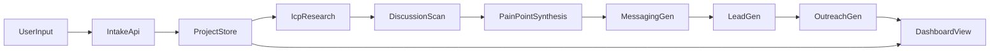

# AI GTM Agent Multi-Plan

## Goal

Build a multi-step GTM workflow that turns one user input into:

- ICP research
- pain-point discovery from real online discussions
- messaging strategy
- lead generation
- personalized outreach drafts
- a dashboard that shows the full pipeline

## Current Repo Baseline

This repo is currently a minimal starter:

- UI entrypoint: [app/page.tsx](app/page.tsx)
- app shell/theme: [app/layout.tsx](app/layout.tsx), [components/theme-provider.tsx](components/theme-provider.tsx)
- utility layer: [lib/utils.ts](lib/utils.ts)
- Convex is installed but not yet wired into product logic: [convex/generated/api.d.ts](convex/_generated/api.d.ts)

That means the plan should treat this as a greenfield product build on top of an existing Next.js + Tailwind + Convex + AI SDK foundation.

## Multi-Agent Workflow

Yes, this should use a multi-agent workflow, but with one orchestrator controlling deterministic handoffs rather than a free-form swarm.

Recommended agent roles:

- `ICPAgent`
  - turns product description + target audience into structured ICP hypotheses
- `ResearchDiscoveryAgent`
  - finds relevant discussions and source URLs using search providers
- `EvidenceExtractionAgent`
  - extracts the complaint text, metadata, and citations from each source
- `PainSynthesisAgent`
  - clusters evidence into recurring pain points with confidence scores
- `MessagingAgent`
  - turns validated pain points into positioning, hooks, and campaign angles
- `LeadAgent`
  - converts ICP filters into provider queries and normalizes returned leads
- `OutreachAgent`
  - creates personalized outbound drafts from lead + pain-point + messaging context

Recommended orchestration model:

- `Convex` actions/mutations handle state transitions and persistence
- each agent writes a typed output artifact
- downstream agents consume stored artifacts, not raw chat history
- failed steps can be retried independently
- the UI subscribes to step status and partial outputs

```mermaid
flowchart LR
  userInput[UserInput] --> orchestrator[WorkflowOrchestrator]
  orchestrator --> icpAgent[ICPAgent]
  icpAgent --> discoveryAgent[ResearchDiscoveryAgent]
  discoveryAgent --> extractionAgent[EvidenceExtractionAgent]
  extractionAgent --> synthesisAgent[PainSynthesisAgent]
  synthesisAgent --> messagingAgent[MessagingAgent]
  messagingAgent --> leadAgent[LeadAgent]
  leadAgent --> outreachAgent[OutreachAgent]
  outreachAgent --> dashboardView[DashboardView]
```

## Specific Technologies

Recommended concrete stack for this repo:

- frontend/app shell: `Next.js 16 App Router`, `React 19`, `Tailwind CSS`, existing shadcn-style component setup
- state/persistence/workflows: `Convex`
- LLM orchestration: `Vercel AI SDK`, `OpenRouter`, `zod` structured outputs
- research discovery: `Exa`
- page fetching / scraping fallback: `Browserbase` + `Puppeteer`
- community sources: `Reddit API` where available, with browser automation fallback only when necessary and legally compliant
- lead data: one provider abstraction around `Apollo`, `People Data Labs`, or `Clearbit`
- observability: persisted step logs in Convex first, optional `Sentry` later

How these fit:

- `Exa` is a strong choice for finding high-signal discussions, threads, and long-tail complaint pages quickly
- `Browserbase` makes sense when pages need authenticated or JS-rendered browsing at scale
- `Puppeteer` is the execution layer for deterministic extraction flows inside Browserbase or local/server runtimes
- `OpenRouter` stays as the model gateway so agent models can be swapped without rewriting orchestration

## Recommended Architecture

- `Next.js App Router` for pages, route handlers, and streaming UI.
- `Convex` for persisted projects, research artifacts, workflow jobs, agent outputs, leads, and outreach drafts.
- `AI SDK + OpenRouter` for structured agent generation and summarization.
- `External provider adapters` for:
  - search/discovery: Exa first
  - social discussion ingestion: Reddit first, designed to support more sources later
  - browser extraction: Browserbase and Puppeteer for JS-rendered pages and resilient scraping
  - lead enrichment/search: Apollo/Clearbit/People Data Labs-style provider abstraction
- `Typed multi-agent orchestration` that runs step-by-step and stores intermediate outputs so the dashboard can update incrementally.

## Data Model

Create Convex tables for the full workflow so each stage is inspectable and retryable.

Suggested core entities:

- `projects`
  - product description, target audience, status, timestamps
- `icpProfiles`
  - segments, job titles, company sizes, industries, responsibilities, confidence notes
- `discussionSources`
  - source type, URL/post ID, community, author metadata, raw content, fetched timestamp
- `painPoints`
  - normalized theme, evidence snippets, frequency, sentiment, source links
- `messagingAngles`
  - angle, value prop, supporting pain points, sample hooks, CTA variants
- `leadLists`
  - provider, search criteria, status
- `leads`
  - name, title, company, company description, source, confidence, enrichment metadata
- `outreachDrafts`
  - channel, subject, body, personalization inputs, status
- `workflowRuns`
  - step name, status, logs, error payload, retry metadata

## Backend Modules

Add a clear server-side domain split under `convex/` and `lib/`.

Recommended module layout:

- `convex/schema.ts`
- `convex/projects.ts`
- `convex/research.ts`
- `convex/messaging.ts`
- `convex/leads.ts`
- `convex/outreach.ts`
- `convex/workflows.ts`
- `convex/http.ts` if webhook/provider callbacks are needed later
- `lib/ai/` for prompt builders and structured generation helpers
- `lib/providers/reddit/` for search/fetch/normalize logic
- `lib/providers/leads/` for provider adapters and a common interface
- `lib/workflows/` for orchestration logic and step contracts
- `lib/validation/` for shared `zod` schemas

## Workflow Design

Use an explicit multi-agent pipeline instead of one giant prompt.

Recommended pipeline:

1. Intake

- Accept `productDescription` and `targetAudience`.
- Create a `project` row and a `workflowRun`.

1. ICP research

- Generate 1-3 candidate ICP segments with structured JSON.
- Persist one primary ICP plus alternates.

1. Discussion discovery

- Use `Exa` to discover relevant discussions and landing URLs.
- Pull from Reddit directly where possible and normalize posts/comments into `discussionSources`.
- Use `Browserbase` or `Puppeteer` when pages require rendered extraction.
- Store raw evidence, not just summaries.

1. Pain-point synthesis

- Cluster complaints into themes.
- Attach quote evidence and source URLs to each pain point.

1. Messaging generation

- Convert themes into value props, landing-page copy angles, and outreach hooks.

1. Lead generation

- Transform ICP into lead-search filters.
- Call provider adapters and store candidate leads.

1. Outreach generation

- Generate role/company-aware messages per lead.
- Save drafts separately from leads for regeneration/versioning.

## UI Plan

Replace the placeholder [app/page.tsx](app/page.tsx) with a dashboard-oriented app.

Recommended screens/components:

- `app/page.tsx`
  - landing + project intake form for product description and target audience
- `app/projects/[projectId]/page.tsx`
  - main campaign dashboard
- `components/project-intake-form.tsx`
- `components/workflow-status.tsx`
- `components/icp-panel.tsx`
- `components/pain-points-panel.tsx`
- `components/messaging-panel.tsx`
- `components/leads-panel.tsx`
- `components/outreach-panel.tsx`
- `components/source-evidence-drawer.tsx`

Dashboard behavior:

- show progress by workflow step
- stream partial results as steps complete
- expose evidence behind each pain point
- allow regenerate for a single step without rerunning the whole pipeline

## API and Integration Strategy

For the broader v1 you selected, keep integrations behind interfaces from day one.

Research adapters:

- Start with `Exa` for search/discovery because it broadens coverage immediately.
- Add `Reddit` as the first deep source implementation because it fits the product promise well.
- Define a generic `DiscussionProvider` so X, Hacker News, G2, LinkedIn, or forums can be added later without rewriting synthesis logic.
- Define a generic `BrowserExtractionProvider` so Browserbase and local Puppeteer flows can share normalization logic.

Lead adapters:

- Define a `LeadProvider` interface returning normalized lead objects.
- Implement one provider first, but keep provider-specific fields isolated in adapter code.
- Normalize company and person data separately so provider swaps do not ripple through the app.

AI generation:

- Use structured outputs with `zod` at every major step.
- Store both final structured output and enough prompt/result metadata for debugging.

## Reliability and Product Safeguards

- Persist raw source evidence so users can inspect why a pain point was produced.
- Add deduplication and spam filtering for scraped discussions.
- Add per-step retry/error states in `workflowRuns`.
- Separate `draft` vs `approved` campaign assets if editing is added later.
- Keep secrets server-only and avoid exposing provider keys to the client.

## Plans

### Plan 1: Platform Foundation

Build the product skeleton and orchestration substrate:

- Convex schema
- project creation
- workflow and agent status tracking
- dashboard skeleton
- shared `zod` contracts for every agent handoff

### Plan 2: Research Agent System

Build the market-research side first:

- `ICPAgent`
- `Exa` discovery integration
- `Reddit` ingestion
- `Browserbase` or `Puppeteer` extraction fallback
- pain-point clustering with evidence and citations

### Plan 3: Campaign Agent System

Build downstream commercial output:

- `MessagingAgent`
- lead provider abstraction
- normalized leads
- `OutreachAgent`
- personalized outbound drafts

### Plan 4: Hardening and Operator UX

Make the system robust and explainable:

- retries/regeneration
- observability/logging
- better loading states
- source inspection UX
- deduplication and trust scoring

## Key Files To Change First

- [app/page.tsx](app/page.tsx): replace placeholder starter with intake experience
- [app/layout.tsx](app/layout.tsx): add app-level providers as needed for Convex/query state
- [convex/schema.ts](convex/schema.ts): define core entities
- [convex/projects.ts](convex/projects.ts): create/read project records
- [convex/workflows.ts](convex/workflows.ts): workflow status and orchestration entrypoints
- [convex/research.ts](convex/research.ts): source discovery, extraction orchestration, and evidence persistence
- [lib/ai/](lib/ai/): structured generation helpers
- [lib/agents/](lib/agents/): per-agent prompts, contracts, and runners
- [lib/providers/exa/](lib/providers/exa/): search and result normalization
- [lib/providers/reddit/](lib/providers/reddit/): discussion ingestion
- [lib/providers/browser/](lib/providers/browser/): Browserbase/Puppeteer extraction flows
- [lib/providers/leads/](lib/providers/leads/): lead search abstraction

## Implementation Notes

- Treat `pain points`, `messaging`, `leads`, and `outreach` as separate persisted artifacts, not one transient response.
- Favor small deterministic prompts with schemas over a monolithic “do everything” prompt.
- Build the system so each agent stage can be rerun independently.
- Design the dashboard around traceability: every major insight should be linked back to evidence.
- Keep discovery separate from extraction so search providers and scraping providers can evolve independently.

## Definition of Done For V1

A user can enter a product description and target audience, trigger one pipeline run, and receive a persisted campaign dashboard containing:

- ICP summary
- evidence-backed pain points from real discussions
- generated messaging angles
- a normalized lead list
- personalized outreach drafts for those leads
