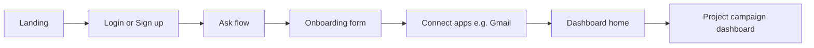

# UX Plan: Auth, Ask-Based Onboarding, and Dashboard

## Current state

- **Stack**: Next.js 16 App Router, React 19, Tailwind, Convex, **[Backboard](https://docs.backboard.io/) (backboard-sdk)** for conversational AI, [shadcn (base-lyra)](components.json). Only [components/ui/button.tsx](components/ui/button.tsx) exists; [app/page.tsx](app/page.tsx) is a placeholder.
- **GTM context**: Existing [.cursor/plans/gtm-agent-v1_065c1599.plan.md](.cursor/plans/gtm-agent-v1_065c1599.plan.md) defines intake (product + target audience), project dashboard at `app/projects/[projectId]/page.tsx`, and Convex-backed workflow. This UX plan adds auth and expands intake to include name, goals, and app connections (e.g. Gmail).

---

## User flow (high level)

1. **Auth** — User lands, logs in or creates an account.
2. **Ask** — User “asks” (e.g. one prompt or short chat); system responds with a structured onboarding form.
3. **Onboarding form** — Collects: name, goals, product description, and app connections (e.g. Gmail for outreach).
4. **Dashboard home** — Main app home after onboarding (list/summary of projects, then drill into a project campaign dashboard).

---

## 1. Auth (login / sign up)

**Routes**

- **Unauthenticated**: `/` or `/login` — landing + auth (login/signup).
- **Post-auth redirect**: If no onboarding yet → `/onboarding`; else → `/dashboard` (or `/home`).

**Auth provider**

- **Option A (recommended)**: [Convex Auth](https://docs.convex.dev/auth) — same backend, no extra service; supports email/password and OAuth (e.g. Google/GitHub). Store user in Convex `users` (or similar) and optionally link to `projects` / onboarding state.
- **Option B**: Clerk — drop-in UI and social logins; wire Clerk user ID into Convex for project/onboarding data.

**UI**

- Single auth page or tabs: “Log in” and “Sign up” (or separate `/login` and `/signup`).
- Use shadcn: **Card** (auth box), **Input** (email, password), **Label**, **Button** (submit, “Continue with Google”, etc.), optional **Tabs** for login vs sign up.
- Optional: **Separator** (“or”), **Alert** for errors.

**Suggested layout**

- [app/page.tsx](app/page.tsx): if unauthenticated, show landing + auth card; if authenticated and not onboarded, redirect to `/onboarding`; else redirect to `/dashboard`.
- Optional `app/(auth)/login/page.tsx` and `signup/page.tsx` if you prefer dedicated routes.
- Wrap app in Convex + auth provider so `useConvexAuth()` (or equivalent) drives redirects.

---

## 2. Ask flow and onboarding form

**Behavior**

- User “asks” (e.g. “I want to run a GTM campaign” or “Help me set up outreach”) → system shows a **single structured form** that collects:
  - **Name** (user or company name)
  - **Goals** (e.g. short text or multi-line)
  - **Product description** (align with GTM plan’s product/target-audience intake)
  - **App connections** — e.g. “Connect Gmail for outreach” (OAuth or “Connect” button that starts Gmail linking)

**Two implementation options**

| Approach           | Pros                                                                                      | Cons                                                                                                                                        |
| ------------------ | ----------------------------------------------------------------------------------------- | ------------------------------------------------------------------------------------------------------------------------------------------- |
| **A. Ask → form**  | One input (or short chat); AI suggests or pre-fills form; then user sees one form screen. | Use **Backboard SDK**: one onboarding assistant, thread per user/session, `addMessage` for the ask; parse or use response to pre-fill form. |
| **B. Direct form** | Single multi-section form (no “ask” step). Simpler.                                       | No conversational “ask” moment.                                                                                                             |

Recommendation: **A** for UX (“ask” first), with the form being a **fixed schema** (name, goals, product description, connections). The “ask” can pre-fill or suggest values via AI; the form is always the same structure so you can persist to Convex and drive the GTM pipeline.

**Route**

- `/onboarding` — “ask” entry (input or 1–2 message chat) + same page or next step shows the form; after submit, redirect to app connections step or directly to dashboard.

**Form fields and shadcn**

- **Name**: **Input** + **Label**.
- **Goals**: **Textarea** + **Label** (or **Input** if one line).
- **Product description**: **Textarea** + **Label** (and optionally “Target audience” to match GTM intake).
- **App connections**: Section with **Card** per app; **Button** “Connect Gmail” (and later others); use **Badge** for “Connected” / “Not connected”; optional **Separator** between sections.

**Other shadcn**

- **Form** (react-hook-form + zod) for validation and submit.
- **Card** to group “About you”, “Goals”, “Product”, “Integrations”.
- **Button** primary for “Continue” / “Finish setup”.
- Optional **Stepper** or **Tabs** if you split into multiple pages (e.g. Ask → Details → Connect apps).

**Data**

- On submit: create Convex `users`/profile row (if not from auth) and a `projects` row (product description, goals, etc.); set “onboarding complete” so next time user goes to `/` or `/dashboard` they skip onboarding.

---

## 3. Dashboard home

**Purpose**

- Post-onboarding home: list or summary of projects, quick actions, and entry point to the GTM project campaign dashboard.

**Route**

- `/dashboard` (or `/home`) — main dashboard.
- `/projects/[projectId]` — existing GTM plan’s project campaign dashboard (ICP, pain points, messaging, leads, outreach).

**Dashboard home content**

- **Header**: App name, user menu (Avatar + **DropdownMenu**), optional theme toggle (already in [components/theme-provider.tsx](components/theme-provider.tsx)).
- **Main**: List of projects (cards or table); each card links to `app/projects/[projectId]/page.tsx`. “New project” CTA if you allow multiple projects.
- Use **Card**, **Button**, **Badge** (e.g. status), optional **Table** or **Skeleton** for loading. Optional **Sidebar** (e.g. **Sheet** on mobile) for nav: Dashboard, Projects, Settings.

**Layout**

- `app/(dashboard)/layout.tsx`: shared shell (header + sidebar or top nav) and Convex/auth guard; children = dashboard home or project dashboard.
- `app/(dashboard)/dashboard/page.tsx` — dashboard home.
- `app/(dashboard)/projects/[projectId]/page.tsx` — project campaign dashboard (per GTM plan).

---

## 4. shadcn components to add

Install via `npx shadcn@latest add <component>` (or your project’s shadcn CLI). Suggested set:

**Auth**

- `card`, `input`, `label`, `tabs`, `separator`, `alert`.

**Onboarding form**

- `form` (with react-hook-form + zod), `textarea`, `checkbox` (if needed for preferences), `select` (if dropdowns for goals/product type).

**App connections**

- `badge`, `card`, `button` (already have).

**Dashboard**

- `card`, `dropdown-menu`, `avatar`, `skeleton`, `table` (or keep card-based list), `separator`, `sheet` (optional sidebar/mobile nav).

**Shared**

- `dialog` or `alert-dialog` for confirmations; `toast`/sonner for success/error after submit or connect.

**Suggested order to add**

1. `input`, `label`, `card` — auth and form.
2. `form`, `textarea` — onboarding form.
3. `tabs`, `separator`, `badge` — auth and connections.
4. `dropdown-menu`, `avatar`, `skeleton` — dashboard shell and lists.
5. `table`, `sheet`, `dialog`, `toast` as needed.

---

## 5. Route and layout summary

| Route                   | Purpose                                 | Guard                                                                                              |
| ----------------------- | --------------------------------------- | -------------------------------------------------------------------------------------------------- |
| `/`                     | Landing + auth or redirect              | If authenticated and onboarded → `/dashboard`; if authenticated and not onboarded → `/onboarding`. |
| `/onboarding`           | Ask + onboarding form + app connections | Auth required; if already onboarded → `/dashboard`.                                                |
| `/dashboard`            | Dashboard home (project list)           | Auth + onboarding required.                                                                        |
| `/projects/[projectId]` | Project campaign dashboard              | Auth + onboarding; optionally check project access.                                                |

Use one **layout** for auth (minimal) and one for app (dashboard shell with nav and user menu). Example group layout:

- `app/(auth)/layout.tsx` — centered, no sidebar (for login/signup if you split them).
- `app/(app)/layout.tsx` or `app/(dashboard)/layout.tsx` — Convex auth check, sidebar/header, then `children` (onboarding or dashboard pages).

---

## 6. Alignment with GTM plan

- **Intake**: GTM plan’s “product description + target audience” is a subset of this onboarding form; add “name”, “goals”, and “app connections” and persist the same Convex `projects` (and workflow) from the onboarding submit.
- **Dashboard**: Dashboard home is the “list of projects”; project campaign dashboard stays at `app/projects/[projectId]/page.tsx` with workflow status, ICP, pain points, messaging, leads, outreach as in the GTM plan.
- **Convex**: Add `users` (or use auth’s user store) and an `onboardingComplete` (or project-linked) flag; keep `projects` and workflow tables as in the GTM plan.

---

## 7. Out of scope for this UX plan

- Gmail OAuth implementation (only UX: “Connect Gmail” button and connected state).
- Full GTM pipeline UI (handled by existing GTM plan).
- Actual AI “ask” implementation use **Backboard** ([backboard-sdk](https://docs.backboard.io/quickstart)) — create an onboarding assistant, thread per user/session, `addMessage` with the user's ask; use the reply to pre-fill or suggest form fields (UX: one input or short chat that leads to the form).

This plan is ready for implementation: auth first, then onboarding (ask → form → connections), then dashboard home and project dashboard, using shadcn throughout as listed.
